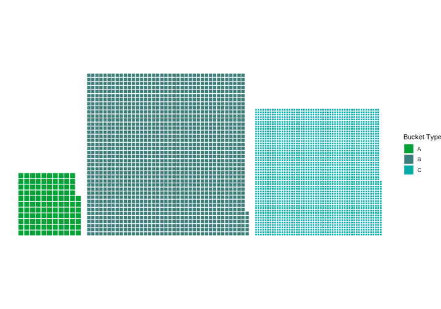

# Wafflechart with variable grid sizing with ggplot2

## Project Overview

This project demonstrates the creation of a **spatial grid visualization** using R and ggplot2, where data points (circles) are dynamically scaled and colored based on their corresponding attributes. The visualization includes: - Circles arranged in a grid pattern based on provided `x` and `y` coordinates. - Sizes calculated dynamically using the formula:\
`square_size = sqrt(marbles / number)` - Custom colors representing categories (`bucket_type`). - A unified legend showing both bucket types and their corresponding circle sizes.

## Features

-   **Dynamic Circle Scaling**: Sizes are computed and normalized to ensure a visually appealing plot.
-   **Customizable Colors**: Each `bucket_type` is assigned a distinct color using a color mapping.
-   **Unified Legend**: Combines size and color into a single, clear legend for better interpretability.

------------------------------------------------------------------------

## Data Description

The input data (`grid_data`) includes the following fields:

\- **`bucket_type`**: A categorical variable representing different types (e.g., A, B, C).

\- **`number`**: Number of elements to arrange into the grid.

\- **`marbles`**: The size of the objects used for scaling.

\- **`square_size`**: Calculated as `sqrt(marbles / number)`, representing the relative size of each circle.

\- **`x` and `y`**: Coordinates for arranging the circles in a grid.

------------------------------------------------------------------------

## Visualization

The output is a **spatial grid plot**, where: 1. Circle **size** represents the relative value of `square_size` (normalized for display). 2. Circle **color** represents the `bucket_type`.

Example: 

## License

This project is licensed under the MIT License. See the LICENSE file for details.
